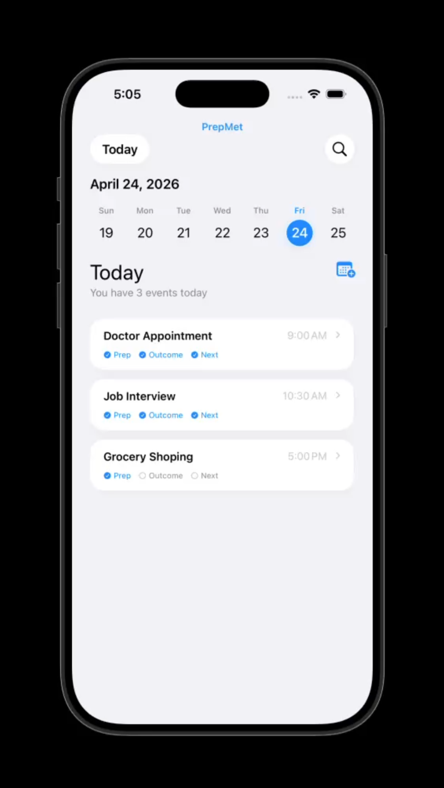
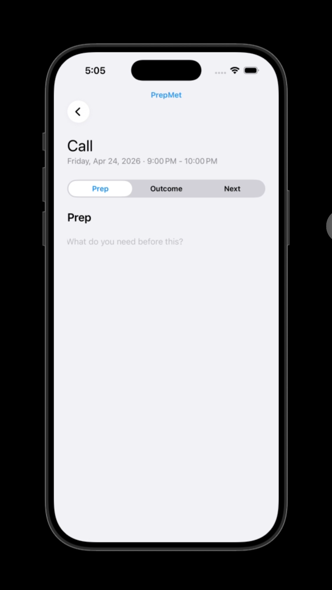
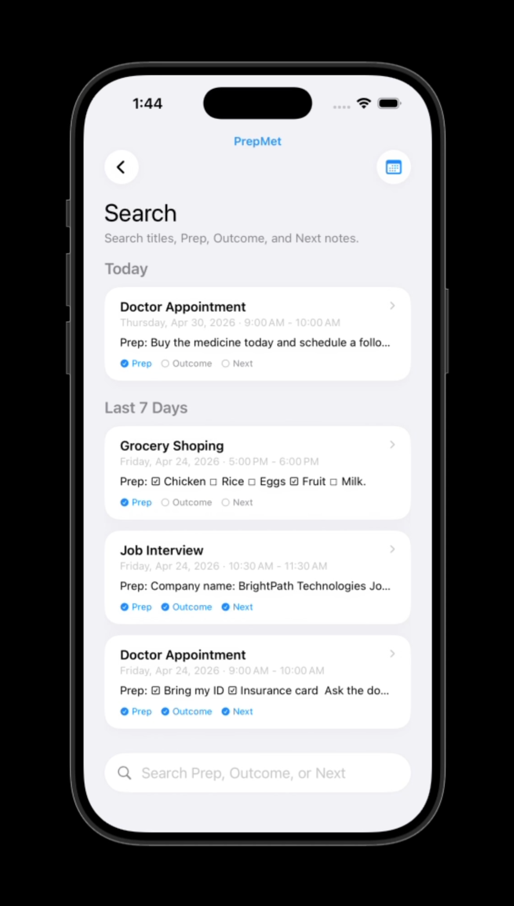
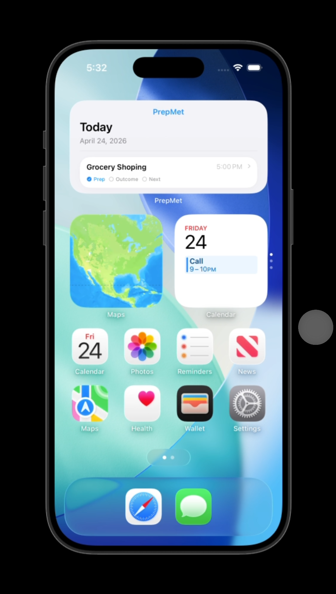
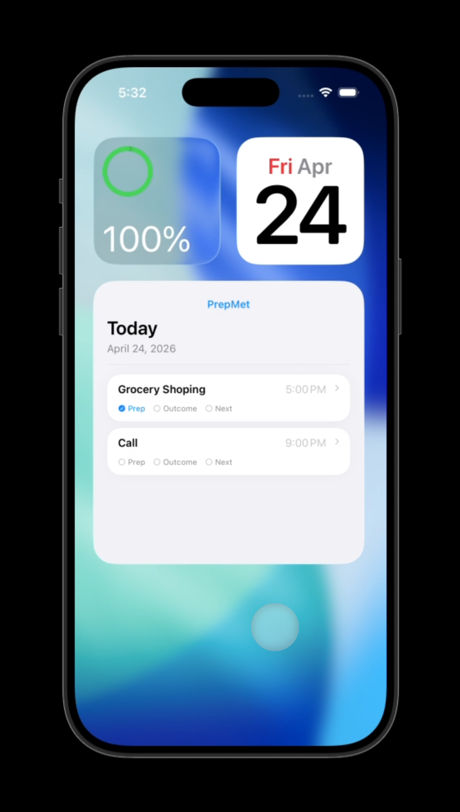

# PrepMet

PrepMet is a simple event preparation app designed to help users organize what they need before, during, and after important events.

Instead of treating calendar events as isolated reminders, PrepMet connects each event with three clear sections:

- **Prep** — What do I need before this?
- **Outcome** — What was decided or achieved?
- **Next Steps** — What happens next?

The goal of PrepMet is to make meetings, appointments, classes, interviews, and personal events easier to manage without overcomplicating the experience.

---

## App Overview

PrepMet helps users stay prepared by turning calendar events into actionable notes. Each event can include preparation notes, outcomes, and follow-up tasks in one place.

The app is designed around speed, simplicity, and real-life use. Users can quickly review today’s events, open an event, add relevant notes, and keep track of what needs to happen next.

PrepMet is especially useful for:

- Work meetings
- Medical appointments
- Classes
- Job interviews
- Personal reminders
- Follow-up tasks
- Any event that requires preparation or reflection

---

## Key Features

### Today View

The Today screen gives users a quick overview of their daily events. Events are displayed in a clean card layout so users can quickly see what is coming next.

### Event Detail

Each event includes three main sections:

#### Prep

A space to write what needs to be reviewed, prepared, printed, practiced, or remembered before the event.

#### Outcome

A space to record what happened during the event, including decisions, results, important notes, or conclusions.

#### Next Steps

A space to track follow-up actions, future tasks, reminders, or anything that needs to happen after the event.

### Calendar-Based Workflow

PrepMet is designed to work around real calendar events. The app helps users connect their schedule with practical notes and follow-up information.

### Widgets

PrepMet includes widgets so users can quickly see important events and access their preparation information from the home screen.

### Search

The app includes search functionality to help users find events, notes, or information quickly.

---

## Why PrepMet?

Many calendar apps help users remember when something happens, but they do not always help users prepare for it or follow up afterward.

PrepMet fills that gap by focusing on three simple questions:

1. What do I need before this event?
2. What happened during this event?
3. What needs to happen next?

This makes the app useful not only before an event, but also during and after it.

---

## Project Repository

[View the PrepMet GitHub Repository](https://github.com/CamiloVegaCreativeTechnologist/PrepMet)

---

## App Overview

[Watch the PrepMet Demo](https://www.youtube.com/shorts/WaumcFxUCi0)

---

## Screenshots

## Screenshots

<p align="center">
  
  
  
</p>

<p align="center">
  
  
</p>

---

## Setup

To run PrepMet locally:

1. Clone the repository:

```bash
git clone https://github.com/CamiloVegaCreativeTechnologist/PrepMet.git
